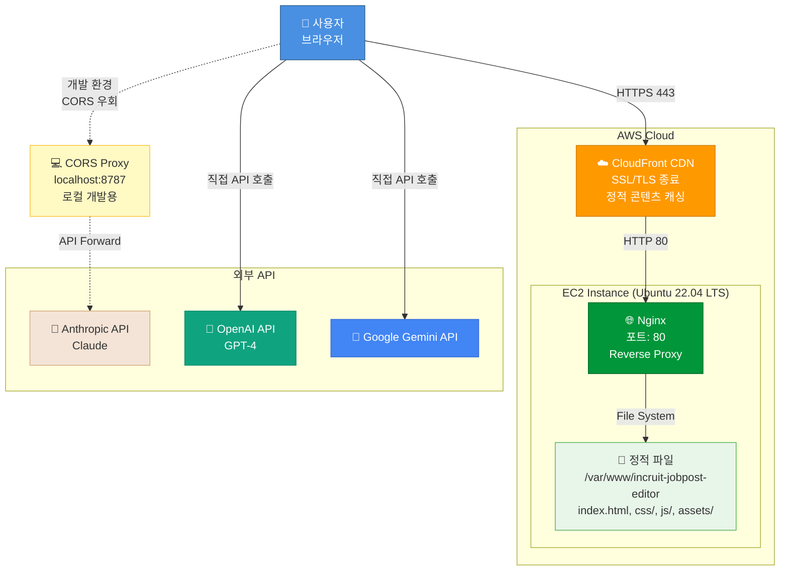
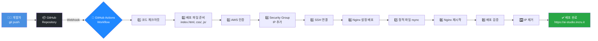
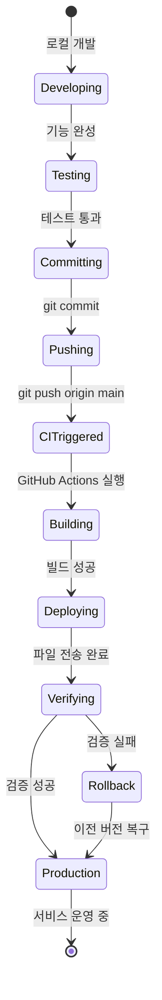
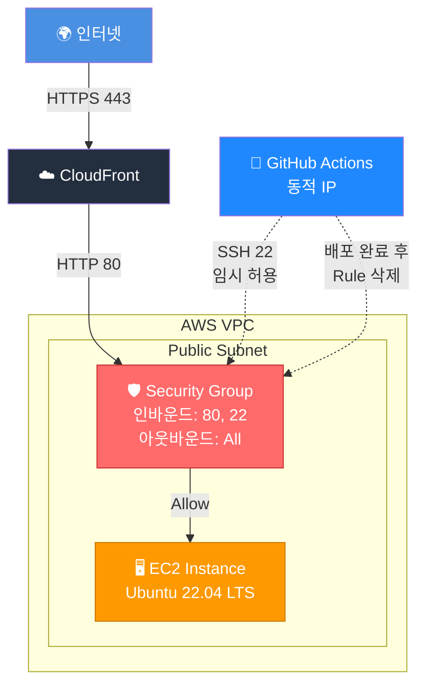
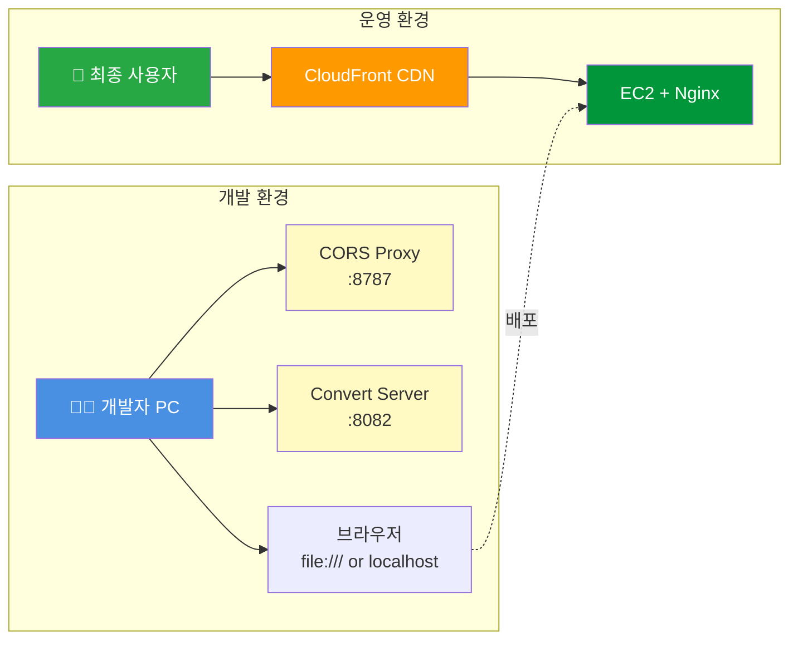
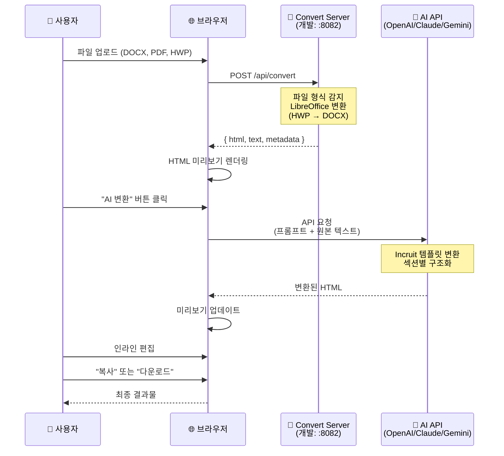
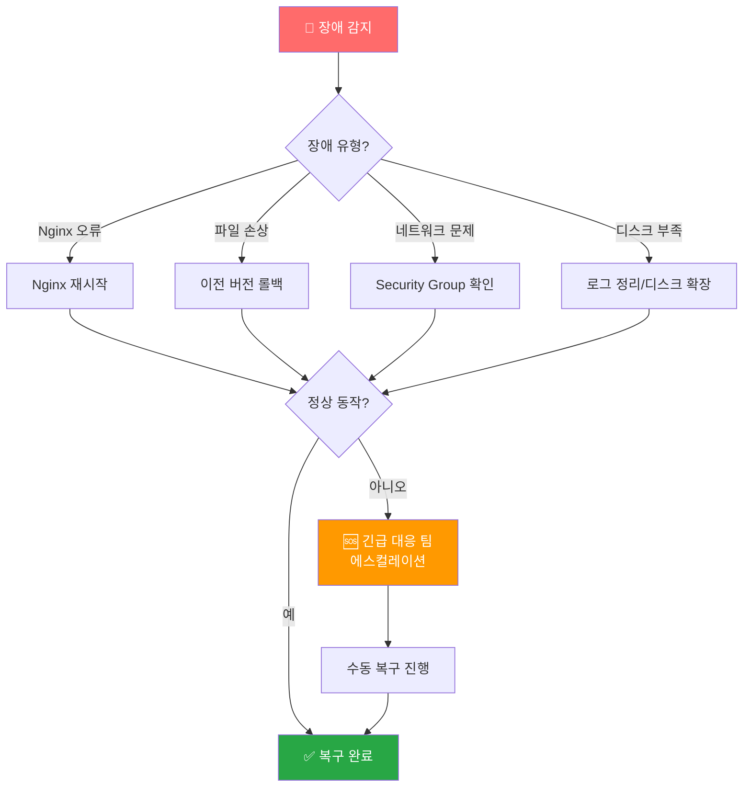

# 시스템 아키텍처 도식

## 전체 시스템 구조



## CI/CD 배포 파이프라인



## 배포 전후 상태 변화



## 네트워크 보안 구조



## 개발 vs 운영 환경 비교



## 데이터 흐름: 문서 변환 프로세스



## 장애 발생 시 복구 흐름



---

## 파일 구조 맵

```
incruit-jobpost-editor/
│
├── 📄 index.html              # 메인 HTML
│
├── 📁 css/                    # 스타일시트
│   ├── main.css
│   └── tailwind.config.js
│
├── 📁 js/                     # JavaScript 모듈
│   ├── app.js                 # 메인 앱
│   ├── services/              # API 서비스
│   │   ├── aiService.js       # AI 호출
│   │   ├── fileExtractor.js   # 문서 변환
│   │   └── urlExtractor.js    # URL 파싱
│   └── utils/
│
├── 📁 assets/                 # 정적 리소스
│   ├── images/
│   └── fonts/
│
├── 📁 nginx/                  # Nginx 설정
│   └── incruit-jobpost-editor.conf
│
├── 📁 .github/                # CI/CD
│   └── workflows/
│       └── deploy.yml
│
├── 🐍 cors-proxy.py           # CORS 프록시 (개발용)
├── 🐍 convert-server.py       # 문서 변환 서버 (개발용)
├── 📋 requirements.txt        # Python 의존성
│
└── 📁 docs/                   # 프로젝트 문서
    ├── 01-plan/
    ├── 02-design/
    └── schema/
```

---

**참고**: 위 다이어그램은 [Mermaid](https://mermaid-js.github.io/)로 작성되었습니다. GitHub README에서 자동으로 렌더링됩니다.
